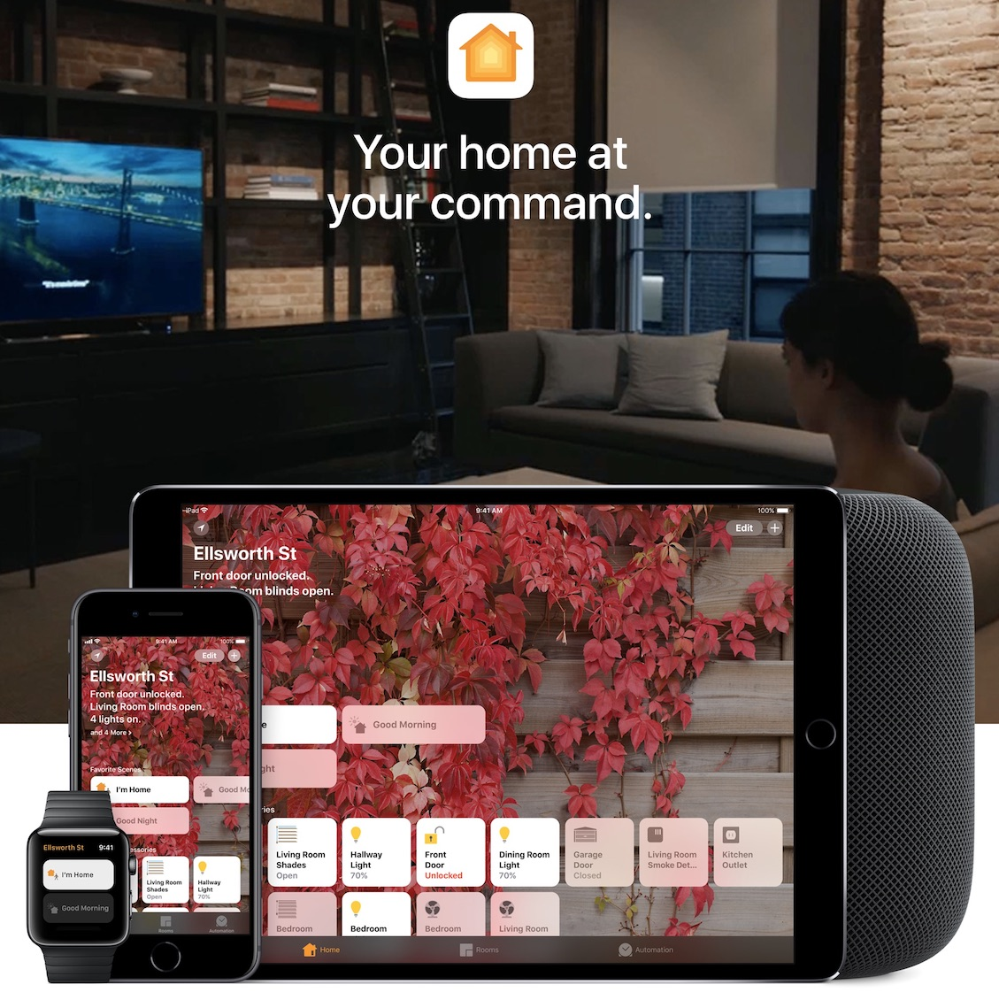

**Enabling Homekit and Siri for Jablotron Alarms**
In the beginning of 2017 I bought and installed a Jablotron JA-100 alarm system in my home, it was easy to install, works great and offers a lot of options for automation which is great since Ive automated 90% of the stuff I do in my house. However it was missing 1 feature, Homekit. Let’s fix that!

If you are unfamiliar with Homekit, it’s Apple’s home automation integration, it basically bundles all of your smart devices in the Home app and lets you control it from 1 app, share access to family and friends, but most importantly provide a secure gateway for remote access and location based automation. See: https://www.apple.com/ios/home/

The objective for the Jablotron Homekit integration is:
Arm and dis-arm the alarm based on location
Have other devices perform actions based on the status of the alarm
Include the alarm in scenes
Control Jablotron from the Home app
Control Jablotron with Siri

Since we Homekit isn’t enabled on Jablotron we need a bridge to connect Jablotron to Homekit, we will be using Homebridge for this.

**What is Homebridge?**
Homebridge is a lightweight NodeJS server you can run on your home network that emulates the iOS HomeKit API. It supports Plugins, which are community-contributed modules that provide a basic bridge from HomeKit to various 3rd-party APIs provided by manufacturers of "smart home" devices. See: https://github.com/nfarina/homebridge

**Components**
Components used in this instructions:
- Raspberry PI Zero W
- Raspberry Pi Zero case
- USB charger + Micro USB cable
- SD card (32gb) with Jessie Lite installed
- Jablotron JA-101KR LAN w/ GSM and radio
- Router with WiFi

The above components can be changed out to your liking, just make sure you check the compatibility with Homebridge.

**Homekit dependencies**
In order to use Apple Homekit you need to make sure you meet Apple’s requirements, most notably the requirements on automation and remote access. See: https://support.apple.com/en-us/HT207057

**Installation options**
- Following along this tutorial should be quite OK, but you have a few options to getting this up and running:
- Follow along this tutorial
- Contact us for a prepped SD card or a whole Pi with OS
- Use an existing Homebridge installation
- Download the Homebridge for Raspberry Pi app which will do all the installation work for you https://itunes.apple.com/nl/app/homebridge-for-raspberrypi/id1123183713?mt=8

**Future development**
If you like to contribute feel free to send me a message and I'll share the code.

**Preparing the OS**
For our OS we will be using Jessie Lite, get the latest version from:
http://downloads.raspberrypi.org/raspbian_lite/images/

Follow the instruction on how to install it on your SD card:
https://www.raspberrypi.org/documentation/installation/installing-images/

Please read the included README.txt

After installing the OS on the SD card, perform the following steps:
Open the SD card in Finder or Explorer and go the root / home folder
Create an empty file called “ssh.txt”, this will enable us to SSH into the Pi

Create a second file called “wpa_supplicant.conf” with the following contents:

	ctrl_interface=/var/run/wpa_supplicant
	network={
	    ssid=“your_wifi_name”
	    psk=“your_wifi_password”
	}

This will make sure that the Pi connects to your WiFi.

Alternatively you can use the command line to perform these commands.

**Prepping the Pi**
Insert the SD with OS into the Pi, close the case and hook the power up. Verify that it works, by checking if the Pi’s light is blinking.

Lets get started
Now that we have all our components and software its time to boot up the Pi for the first time, installing the plugins and connecting it your Homekit. If you have downloaded the prepped OS then skip until the next steps and go straight to “Connecting to Homekit”, if you have an existing Homebridge installation skip to “Installing Jablotron plugin”

**Connecting to the Pi**
After the Pi has booted, open the terminal on MacOs or use an SSH client such as putty on Windows. On MacOS connect via the terminal with the following command:

	ssh pi@raspberrypi.local

The default password should be “raspberry”. After logging in the first thing we will do is change the password by executing:

    passwd

**Installing Homebridge and required packages**
Allright installing Homebirdge can sometimes be a bit difficult, mostly due to different versions of Pi’s, OS’s, etc. So the following steps should help you to get it up and running but its best to check the latest installation guide on and preferably follow that guide: https://github.com/nfarina/homebridge/wiki/Running-HomeBridge-on-a-Raspberry-Pi

Make sure you are connected to the Pi and execute the following commands one by one:

	sudo apt-get update
	sudo apt-get upgrade

Install Git:

	sudo apt-get install git make

Install Node:

	curl -sL https://deb.nodesource.com/setup_6.x | sudo -E bash -
	sudo apt-get install -y nodejs
	sudo apt-get install -y build-essential

Set up NPM:

	mkdir ~/.npm-global
	npm config set prefix ‘~/.npm-global’
	export PATH=~/.npm-global/bin:$PATH
	source ~/.profile

Install Avahi

	sudo apt-get install libavahi-compat-libdnssd-dev

Install Homebridge

	sudo npm install -g --unsafe-perm homebridge

Start Homebridge at boot of the Pi

	sudo apt-get install screen

Edit the file by executing:

	sudo nano /etc/rc.local

Add this line before the exit 0 line:

	su -c "screen -dmS homebridge homebridge" -s /bin/sh pi

Press CRTL + X to save and exit.

**Installing Jablotron plugin**
At this moment the package isn’t on npmjs so we will install it from Github by executing the following command:
	npm install -g git+https://github.com/F4stFr3ddy/homebridge-jablotron-alarm.git

**Creating the homebridge config**
On the command line and create the config file:
	nano ~/.homebridge/config.json

If the config is empty, add the following to the file, otherwise proceed to changing the credentials:

    {
        "bridge": {
            "name": "Homebridge",
            "username": "CC:22:3D:E3:CE:30",
            "port": 51826,
            "pin": "031-45-155"
        },
        "accessories": [
            {
                "accessory": "Homebridge-Jablotron",
                "name": "Alarm System",
                "username": "your@email.com",
                "password": "yourawesomepassword",
                "pincode": "1234",
                "service_id": "123456",
                "segment": "section_1"
            }
        ]
    }

Change the username to your Jablotron username, it is advised to create a new account for the sole purpose of controlling the alarm via Siri and limiting the authorization on that account.

Change the password to the corresponding password.

Change the pincode to the corresponding pincode.

To get the service id, we have to do a bit of work, first execute this command where you changed the login to your username and the password to your password, please not this is 1 command:

    curl -H 'x-vendor-id: MyJABLOTRON' --data "login=YOUR_USERNAME&password=YOUR_PASSWORD" --compressed 'https://api.jablonet.net/api/1.6/login.json'

This will give back some info, locate the session_id, it looks like this:

    “session_id”:"lol808b3aahej01s7abc1a12f38"

Copy the alphanumeric string, and paste in the below command where it says SESSION_ID, after doing that execute the command

    curl -H 'x-vendor-id: MyJABLOTRON'  -H 'Cookie: PHPSESSID=SESSION_ID' --data-binary '{"list_type":"extended"}' --compressed 'https://api.jablonet.net/api/1.6/getServiceList.json'

This will give a reply, locate the following:

    {“services":[{"id":1234567,"name":"Your alarm”,"service_type":"JA100"

Copy the value behind ‘id’ this is your service_id, if there are multiple, choose the one that you want to add to Homekit.

Change the segment to the segment that you want to control. Usually this is ‘section_1’

**Connecting to Homekit**
On the command line, execute:

	screen -S homebridge
	homebridge

On your iOS device open “Home”, click on the plus icon in the top right corner, click “add accessory” and scan the QR code displayed in on the command line.

Exit homebridge on the command line by pressing CTRL + Z, followed by executing the command:

	sudo reboot

The Pi will now reboot and after a couple of minutes it will be back online and Homebridge will be up and running.

**Usage**
Now that we have connected the Pi to Jablotron and our Homekit we can start to control Jablotron via Homekit but also automate it.

The current setup of Jablotron as an Alarm System in Homekit requires user authentication when executing automations. For example when the first person arrives home, turn the alarm off. This will prompt a notification on your iOS device or watch asking if you want to execute this command.

This works every time and has the added benefit of being more secure, alternatively it is possible to make the Jablotron alarm appear as a switch and then the automation will work without confirmation.

If you want to use Siri for controlling the alarm, you need to create a scene, which switches the alarm on or off and then ask Siri to set that scene.
